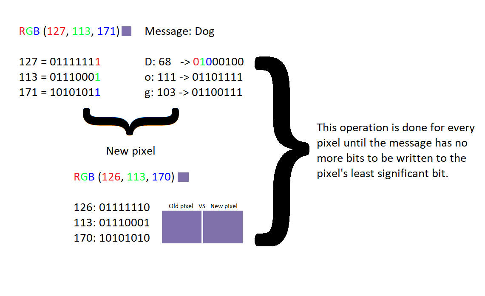

# Steganography

 

A simple steganography algorithm. This is project is really simple (and not inovative at all 😅) and is being developed for fun on my free time only, as of consequence is not intented to be complex or extensive.

"Steganography is the practice of concealing a message within another message or a physical object. In computing/electronic contexts, a computer file, message, image, or video is concealed within another file, message, image, or video. " - Wikipedia

This code will take any text and put it inside a image.

>Disclaimer: It is NOT recommended using this if you intend to actually hide text inside an image as it's not really hard to decode the message.

## Table of contents

1. [Steganography](#Steganography)
2. [Table of contents](#Table-of-contents)
3. [Usage](#Usage)
4. [Contributing](#Contributing)
5. [How it works](#How-it-works)

## Usage

>This project is currently being developed on Python 3.8.5 and Ubuntu 20.04.2 LTS, any other enviroment may not work properly.

Currently we can only run the `stenography/main.py` directly (But we have plans for a CLI). If you wish to run an example you should follow the steps below:

Install poetry:

[https://python-poetry.org/docs/](https://python-poetry.org/docs/)

Clone the repository and go inside it:

`$ git clone https://github.com/JBizarri/steganography.git && cd steganography`

Create a virtual environment:

`$ python3 -m virtualenv venv`

Activate the virtualenv

`$ source venv/bin/activate`

Install requirements with poetry:

`$ poetry install --no-dev`

Run:

`$ python3 examples/encode_and_decode.py`

You should see "Sample text" printed on your console.

## Contributing

If you wish to contribute you can have a look at our [CONTRIBUTING.md](CONTRIBUTING.md) for a more detailed guideline.

Please run `$ poetry install` for the development dependencies and `$ poetry run pre-commit install` for the pre-commit hooks. This way tox will run everytime you try to make a commit and check for any linting, formatting and testing errors.

When making a Pull Request:

- If you added new features you should also add tests for them.
- Be sure every file is following our code conventions and all tests are fine by running `tox`. Otherwise we won't be able to merge your PR.
- Update any documentation such as doctstrings, this README file and any other relevant file.

## How it works

1. Convert each letter from the secret message to ASCII code, the word "Dog" for example:

    - D: 68
    - o: 111
    - g: 103

2. Convert each ASCII code to binary, following the last example we have:

    - 68: &nbsp;01000100
    - 111: 01101111
    - 103: 01100111

3. Repeat step 2 for the RGB values of a pixel (e.g rgb(255, 255, 255)).

4. Change the least significant bit from the pixel to the first three values from step 2 (010, letter "D" from ASCII code 68). Then move to the next pixel and repeat the operation until the whole message has been written.

